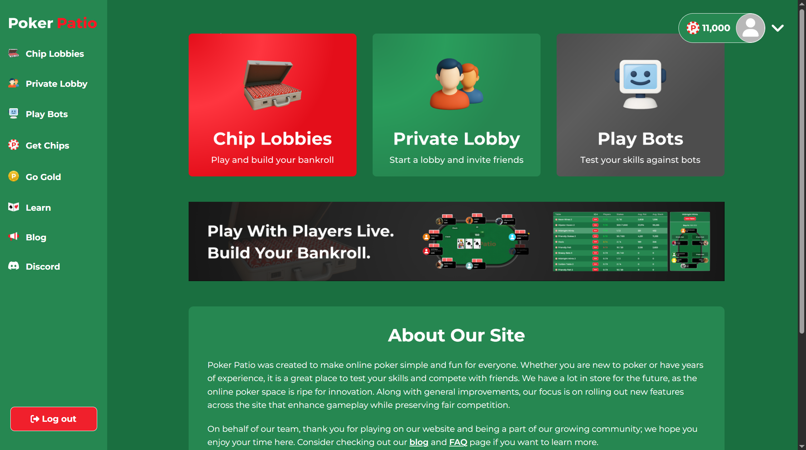
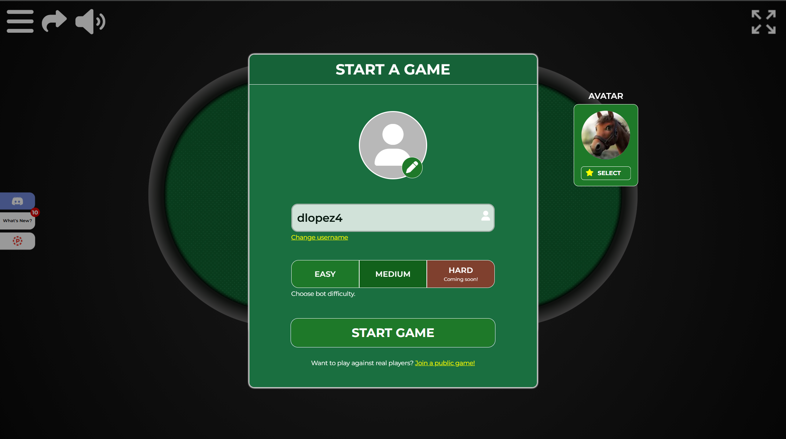
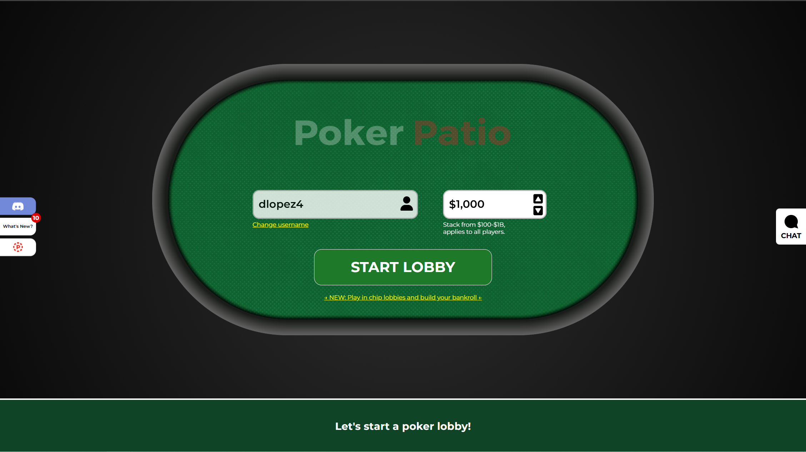
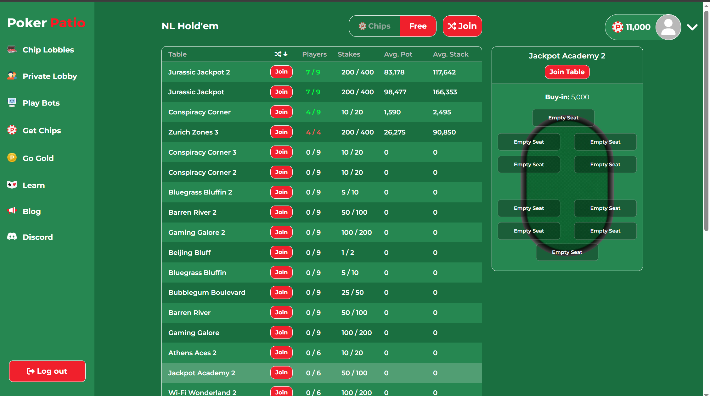

#  **Finding a Free Game Shouldn't Be This Hard**

After making an account to use PokerPatio, which was straightforward, I wanted to jump into a casual game of poker against other players. Since chips were a limited currency given when first joining and required real money to replace, I preferred to play the free option. Most poker sites have a free-to-play option, so I thought it would be easy to find, but it was not immediately clear where to find the option.

While on the home page of PokerPatio I was given three main options to join a game: Chip Lobbies, Private Lobby, and Play Bots. Although these options followed the common convention that many sites use to clearly present options to allow players to join a game quickly, I had expected a distinct option to join a free multiplayer game. Many other poker sites make these options obvious, so I assumed it would also be easy to find on the homepage. When I failed to find the option, I decided to check the side menu, but was still not able to find the option for free play.

 As the image shows there was no obvious way to find the option to play against other players without chips. This was confusing since I was expecting a more direct option to join a free game that would be obvious to players. 

Play Bots went straight to game against bots like the buttons say and Private lobby also did not match my goal to join a free multiplayer game. I eventually selected the Chip Lobbies to find the options and finally found the option to change from chips to free gameplay as a small button above joinable games, which seems backwards to have within the Chip Lobbies option. I was not expecting my **mental model** of finding a free game against other players to not match the **conceptual model** of actually getting into a free game with other players.

Finally finding the free game option required some navigation through the site but I was able to look through menus to find the correct option. From a **heuristic evaluation** this did not match the real world, as the path was unintuitive and had unnecessary steps. It required going through the Chip Lobbies which does not seem like the correct path to go through as I was looking to play without needing chips. As such many users may come to the conclusion that the only way to play is by using chips or settle playing against bots.  Making the option to switch from chips to free more obvious by adding it to the home page would solve the problem of finding free multiplayer games.

